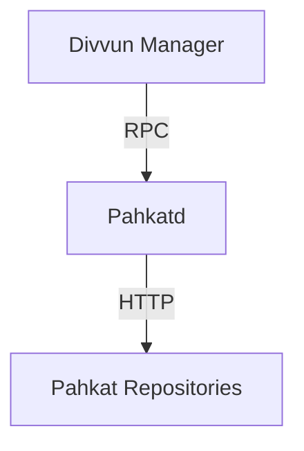

# Divvun Manager for macOS

[](https://divvun-tc.giellalt.org/api/github/v1/repository/divvun/divvun-installer-macos/main/latest)

## Overview

Divvun Manager is a macOS app that manages the installation and configuration of Divvun spellers and keyboards via [Pahkat](https://github.com/divvun/pahkat).

Keyboards are installed in `/Library/Keyboard Layouts/`.

Spellers are installed in `/Library/Services/`.

## Download

- [Stable](https://pahkat.uit.no/divvun-installer/download/divvun-installer?platform=macos)
- [Nightly build](https://pahkat.uit.no/divvun-installer/download/divvun-installer?channel=nightly&platform=macos)

## Architecure

Divvun Manager installs and communicates with Pahkatd via RPC over a UNIX socket. Pahkatd is a service that manages package installation and removal. It is written in Rust and is available at [divvun/pahkat](https://github.com/divvun/pahkat).



## Running Locally

To run everything locally, you must also run `pahkat-rpc` locally. To do this:

1. Clone <https://github.com/divvun/pahkat>
2. Make sure the socket path is the same between [macOS](https://github.com/divvun/divvun-manager-macos/blob/d20581050bde718a18f36ab0af0212726267e9e3/Sources/AppContext.swift#L67) and [pahkat-rpc](https://github.com/divvun/pahkat/blob/df904637978abb8f9c0ae545d58ee442c6169e12/pahkat-rpc/src/bin/server.rs#L8) (you might need to temporarily change it in Pahkat to match the one in macOS)
3. If you have Divvun Manager installed, make sure pahkatd is not running. The easiest way to do this is to delete `/Applications/Divvun Manager.app/Contents/MacOS/pahkatd` and kill `pahkatd` in Activity Monitor.app
4. Run `pahkat-rpc`. Go to the pahkat-rpc dir and run `cargo run --bin server --features macos`
5. Run Divvun Manager from Xcode.

You should see evidence that Divvun Manager is connecting to your locally running instance of pahkatd.

## Generating Localisations

This project uses [bbqsrc/strut-icu](https://github.com/bbqsrc/strut-icu) to manage the generation of localisations.

If you make an update to anything in `Sources/Support/LocalisationResources/`, run from the `Pahkat/` directory:

```bash
strut-icu-generate swift Support/LocalisationResources/base.yaml Support/LocalisationResources/{your other langs}.yaml
-o .
```

## Localisation of entries

- language names: [make PR here](https://github.com/divvun/iso639-databases)
- package names/descriptions:
  - keyboards: add entries in `keyboard-XXX/XXX.kbdgen/project.yaml`
  - spellers: add entries in `lang-XXX/manifest.toml.in` (not yet supported)

## Logging

Log files can be bundled and exported in the help menu. It gather log files from Divvun Manager, Pahkatd and MacDivvun.
Since the app is running as user, all log folders need to be accessible by others. (Pahkatd service checks folder permission on every launch)

## Cleanup MacDivvun

If for some reason [MacDivvun](https://github.com/divvun/macdivvun-service) has been uninstalled or
removed without the help of Divvun Manager, it can't be fixed automatically by it.
To fix a situation like this, do as follows:

- add the following url to the repo list in the Divvun Manager settings: `https://pahkat.uit.no/tools`
- a section **Divvun Tools** should appear at the end of the **All Repositories** listing
- uninstall **MacDivvun Speller Engine** by checkmarking it and run uninstall
- reinstall **MacDivvun Speller Engine** by checkmarking it and run install
- restart your computer

It should really not be necessary to do this. If it happens more than once, try to notice what caused it to happen, and file a bug report in [issues](https://github.com/divvun/divvun-manager-macos/issues).

## License

GPLv3 — see LICENSE file.

